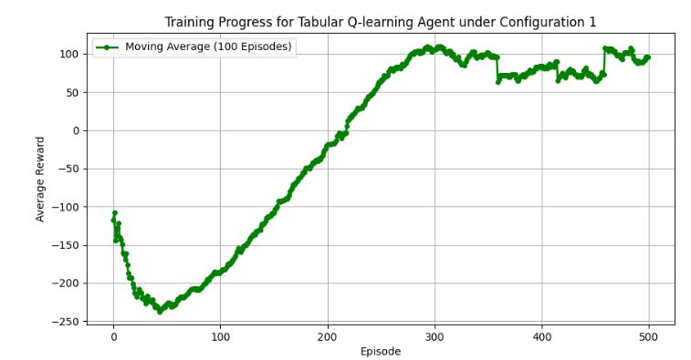
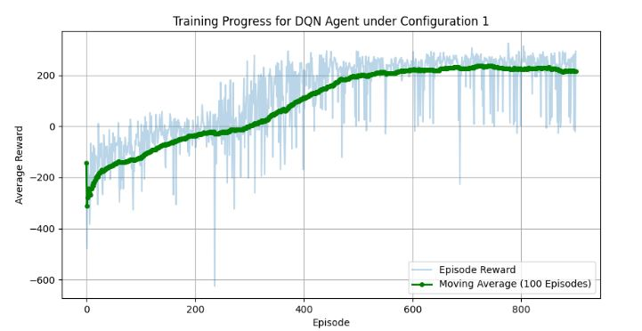
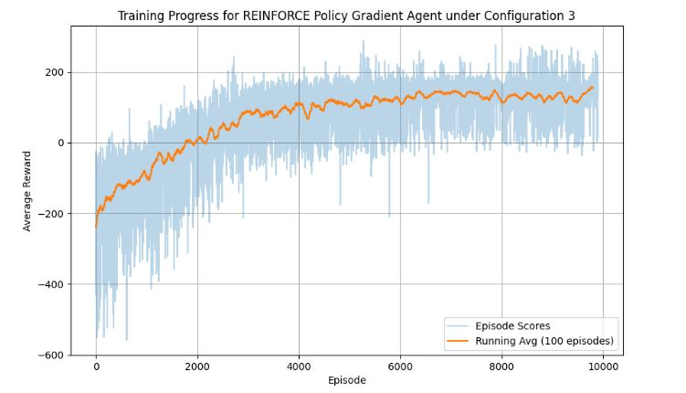

# Reinforcement-Learning-for-Rocket-Landing-Simulator

The goal of this project is to develop, train, and compare three reinforcement learning
agents to solve the Lunar Lander problem; a game where you must land a spacecraft safely
between two flags in a “windy” environment. The environment assigns rewards based on
the lander's actions and state, encouraging successful landings, and penalizing crashes, or
taking too long. The reinforcement learning algorithms used will be Q-learning, Deep Q-
learning (DQN), and a policy gradient method, each aimed at training an agent to maximize
reward.

Each agent will be trained to attain a satisfactory performance based on performance
metrics such as cumulative reward. The agents' learning curves with varying configurations
will be compared, and insights into their strengths and weaknesses will be analyzed to
further cement our reinforcement learning understanding.

### Important Links

Link to find the LunarLander-Gymnasium Python library:
https://gymnasium.farama.org/environments/box2d/lunar_lander/

*Note: *there is a very common problem with Box2D environments (such as LunarLander) in Gymnasium on Windows typically involving missing C++ build tools and dependencies. 
I did not run into any issues using Linux, but if you do use Windows here is a great video that solves the problem:*
https://www.youtube.com/watch?v=gMgj4pSHLww

## Model Summary

### Q-Learning

The first reinforcement learning algorithm implemented was Q-learning. Q-learning is an
off-policy RL method for control, leveraging the Bellman equation to estimate Q-values
(representing the value of state-action pairs) by episodically updating estimates of future
rewards. These Q-values tell the agent what the reward value is, given taking an action in a
certain state. These equations help the agent identify the best moves to maximize the
long-term reward.

### Deep Q-Learning Network

The second reinforcement learning algorithm implemented was deep Q-learning. Unlike
regular Q-learning, deep Q-learning uses a neural network to approximate the different Q-
values for each state and possible action. It does not rely on using discrete observation
spaces as in Q-learning, which becomes infeasible for large state spaces. The loss function
compares Q-values between the two neural networks and uses gradient descent to update
the weights.

### Policy Gradient

The third reinforcement learning algorithm implemented and used in the Lunar Lander
environment was REINFORCE, a policy gradient method. It uses Monte Carlo methods to
estimate the necessary policy gradients and returns. Unlike Q-learning or DQN, the agent
directly samples all actions from the Lunar Lander environment. The previous two
methods determine their actions based on value function estimating a Q-value.

### Results

Each RL algorithm was tested with 3 different configurations of hyperparameters.
The detailed results can be seen in the Results directory. Please note that these hyperparameter
values implemented were not the most optimal, and more value testing needs to be done.
Please let me know if you find better ones!

After extensive training and hyperparameter tuning, the agents achieved the following performance on 100 test episodes:

| Algorithm | Best Configuration | Average Reward | Success Rate |                                      Key Insight                                       |
 | :------- | :------: |:--------------:|:------------:|:--------------------------------------------------------------------------------------:| 
|Tabular Q-Learning | Config 1 (Baseline) | 129.66 |     62%      | Performs remarkably well given its simplicity, but is limited by state discretization. |
| Deep Q-Network (DQN)| Config 1 (Baseline) | 194.74 | 67% | Most stable and successful. Effectively balances exploration and exploitation with a stable neural network approximation. |
| REINFORCE | Config 3 (Long-term focus) | 119.32 | 7% | Struggles with high variance and slow convergence, but shows potential with careful tuning. |

Conclusion: For the Lunar Lander problem, DQN proved to be the most effective algorithm, reliably learning a high-performance policy. 
Q-Learning was a strong, simpler contender, while the vanilla REINFORCE algorithm required more episodes and was less stable.

Visualized Training Results:

**

### References          

    Gymnasium Lunar Lander Documentation

    Sutton, R. S., & Barto, A. G. (2018). Reinforcement Learning: An Introduction. MIT Press.

    Mnih, V. et al. (2015). Human-level control through deep reinforcement learning. Nature.

    Williams, R. J. (1992). Simple statistical gradient-following algorithms for connectionist reinforcement learning.