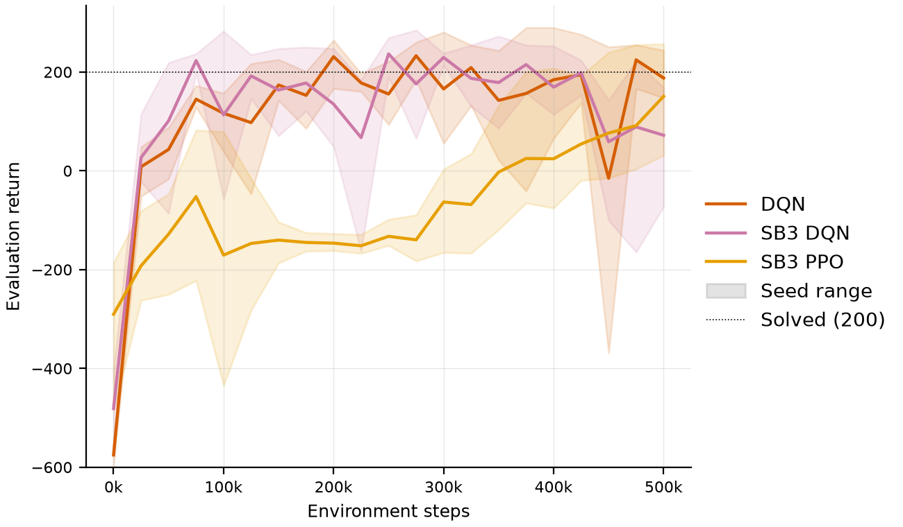

# Reference baselines: Stable-Baselines3 DQN and PPO

The project's three agents are written from scratch, so results from them alone cannot show
whether a weak score reflects the algorithm or a mistake in its implementation. Two
[Stable-Baselines3](https://github.com/DLR-RM/stable-baselines3) (SB3) agents anchor the
comparison:

- **SB3 DQN: an implementation check.** It runs the same algorithm as the project's DQN with
  the same hyperparameters, so the two should perform alike. A large gap would point to a bug.
- **SB3 PPO: a modern reference.** PPO is the standard on-policy method for discrete control,
  and the natural successor to REINFORCE. It adds a learned critic, generalised advantage
  estimation, a clipped objective and batched rollouts from parallel environments. The gap
  between REINFORCE and PPO shows how much those additions are worth.

A2C was left out because PPO generally supersedes it on this task. Distributional variants
(QR-DQN) are out of scope.

## How SB3 is integrated

SB3 runs its own training loop. An adapter
([src/lunarlander_rl/agents/sb3.py](../src/lunarlander_rl/agents/sb3.py)) hooks into it through
an SB3 callback and reports every environment step and finished episode to the same
`TrainingRecorder` that the project's own training loop uses. An SB3 run therefore produces an
identical run directory:
- the same training log;
- periodic evaluations on the same fixed seeds and schedule;
- the same final evaluation on the 100 held-out seeds;
- the same checkpoint files.

Evaluation always runs in the project's environments through its own evaluation code, never
SB3's `evaluate_policy`. The same tests that cover the project's agents also cover the adapter:
- byte-identical results from a repeated seed;
- training unchanged by the evaluation schedule;
- checkpoints that reproduce their reported evaluation;
- learning CartPole.

Points that differ from the project's own loop:

- **Step budgets are exact.** The callback stops SB3 at the budget, so PPO's last rollout is
  collected but not trained on. With *n* parallel environments the budget can be exceeded by
  fewer than *n* steps when it is not a multiple of *n*. SB3 agents accept step budgets only.
- **Vectorised steps.** PPO steps 16 environments at once, so a periodic evaluation runs at the
  first step past each multiple of the evaluation interval, and is logged at that step.
- **Exploration is set in absolute steps.** SB3's `exploration_fraction` is relative to the
  training budget. The adapter takes `exploration_decay_steps` instead, so exploration does not
  change with the budget and matches the project's DQN.
- **Evaluation randomness is isolated.** SB3 DQN is always evaluated greedily (SB3's
  non-greedy DQN prediction draws from NumPy's global generator, which training also uses).
  Stochastic PPO evaluation samples from a separate generator seeded per episode.
- **Training returns use float32 rewards.** SB3's vectorised environments store rewards as
  float32, so training-log returns can differ from float64 sums in the last digits. Evaluations
  are unaffected.

## Hyperparameters

Both agents use the tuned values from [RL Baselines3 Zoo](https://github.com/DLR-RM/rl-baselines3-zoo)
for `LunarLander-v3`: `hyperparams/dqn.yml` and `hyperparams/ppo.yml`, checked against the
repository in October 2026. Values the Zoo leaves unset are SB3's defaults.

| | SB3 DQN ([config](../configs/agent/sb3_dqn.yaml)) | SB3 PPO ([config](../configs/agent/sb3_ppo.yaml)) |
| :--- | :--- | :--- |
| Network | 2 × 256, ReLU | 2 × 64, tanh (separate policy and value networks) |
| Learning rate | 6.3e-4 | 3e-4 |
| Discount γ | 0.99 | 0.999 (GAE λ = 0.98) |
| Data | replay buffer of 50,000, batch 128 | 16 environments × 1,024 steps, batch 64, 4 epochs |
| Updates | every 4 steps, 4 gradient steps | clip range 0.2, entropy coefficient 0.01 |
| Exploration | ε from 1.0 to 0.1 over 12,000 steps | stochastic policy |
| Target network | synced every 250 steps | n/a |
| Zoo budget | 100,000 steps | 1,000,000 steps |

For the implementation check below, the project's own DQN used the same DQN values: Huber
loss, gradient-norm clipping at 10, learning from the first step.

**Change for the main benchmark.** Tuning at the benchmark's 1M-step budget found that the
Zoo's DQN settings, tuned for 100k steps, end in collapsed final policies. Halving the
learning rate to 3e-4 removed the collapse ([results/tables/tuning.md](../results/tables/tuning.md)).
Both [configs/agent/dqn.yaml](../configs/agent/dqn.yaml) and
[configs/agent/sb3_dqn.yaml](../configs/agent/sb3_dqn.yaml) now use 3e-4, so the two DQNs still
share every hyperparameter. The check below was run with the Zoo's 6.3e-4; its settings are
recorded in [configs/experiments/baseline_check.yaml](../configs/experiments/baseline_check.yaml).

## Implementation check on LunarLander

Three seeds of each agent were trained for 500,000 environment steps, with the evaluation
protocol of the main benchmark. This is a check rather than the comparison itself: the main
benchmark uses 1M steps and 10 seeds.



| Agent | Seeds | Env steps | Final return [95% CI] | IQM over seeds | Seed range | Success [95% CI] | Reached 200 | Best checkpoint return | Training time |
| :--- | ---: | ---: | ---: | ---: | ---: | ---: | ---: | ---: | ---: |
| DQN | 3 | 500k | 195.8 [177.4, 231.4] | 195.8 | 177.4 to 231.4 | 68% [64%, 75%] | 3/3 runs, median 200k | 235.2 | 19 min |
| SB3 DQN | 3 | 500k | 116.9 [-24.7, 226.3] | 116.9 | -24.7 to 226.3 | 30% [3%, 84%] | 3/3 runs, median 75k | 242.4 | 21 min |
| SB3 PPO | 3 | 500k | 139.3 [21.2, 246.7] | 139.3 | 21.2 to 246.7 | 39% [4%, 96%] | 1/3 runs | 139.3 | 2 min |

**The project's DQN behaves like SB3's.** The two learning curves are indistinguishable for
most of training: every seed of both first reaches an evaluation return of 150 within
50,000–150,000 steps, and their best checkpoints score alike (235.2 against 242.4 on the
held-out seeds). Their final policies differ more. SB3 DQN's final snapshot crashed in one seed
(−24.7) and hovered until the time limit in another. But the project's DQN shows the same
kind of late collapse: one seed's evaluation return fell to −369 around 450,000 steps before
recovering. With three seeds the final
returns' intervals overlap almost entirely, so this check finds no evidence of an
implementation difference.

**The final snapshot of a DQN policy is a noisy measure.** Both DQN implementations swing by
more than 100 return points between neighbouring evaluations late in training, so a policy's
score depends on exactly when training stops. The main benchmark reports the final policy as
its primary result. Its 10 seeds and the best-checkpoint numbers it reports alongside keep this
from going unnoticed.

**The check holds at full scale.** In the [main benchmark](benchmark.md), with 10 seeds, 1M
steps and the tuned learning rate, the two DQNs reach the same typical performance. The IQM over
seeds is 235.1 for the project's DQN and 237.9 for SB3's, and the best checkpoints score 272.8
and 266.7. SB3 DQN's lower mean (183.2) comes from a single seed whose final policy collapsed.

**PPO learns more slowly per step and far faster per second.** At 500,000 steps it is still
improving (its best checkpoint is its final policy in every seed), consistent with the Zoo's
tuning for 1M steps. Its 16 vectorised environments and cheap updates make a run about ten
times faster in wall-clock time than DQN's.

## Reproducing

```bash
pip install -e ".[sb3]"
python scripts/sweep.py configs/experiments/baseline_check.yaml       # 9 runs, about 20 minutes on 9 cores
python scripts/aggregate.py runs/baseline_check
python scripts/make_tables.py benchmark runs/baseline_check --order dqn sb3_dqn sb3_ppo
python scripts/make_figures.py benchmark runs/baseline_check --order dqn sb3_dqn sb3_ppo
```
