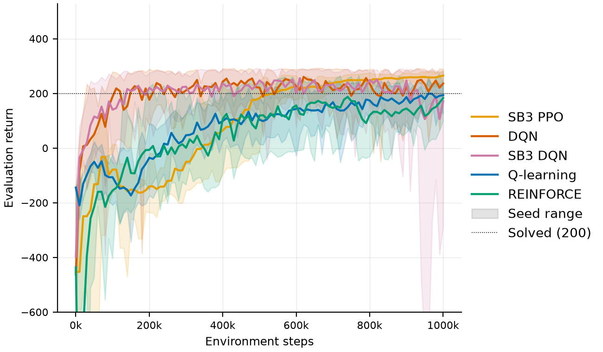

# Main benchmark: five methods at an equal budget

Five methods were compared on LunarLander-v3 under one protocol, each with ten seeds and exactly
1M environment steps of training: the project's Q-learning, DQN and REINFORCE, and
Stable-Baselines3's DQN and PPO.

## Summary

- **SB3 PPO is the strongest and most reliable method.** Final test return 258.8
  [251.6, 265.0], 99% successful landings, and every seed between 233.2 and 274.4. It is also
  the slowest starter: its periodic evaluation first reached 200 after a median 505k steps.
- **The project's DQN is second.** Final return 234.1 [213.2, 254.5] with 79% success. It
  learns fastest, first reaching 200 after a median 95k steps. Its final policies are less
  stable than its best checkpoints, which average 272.8 on the test episodes.
- **The DQN implementation check passes at full scale.** SB3's DQN, with identical
  hyperparameters, reaches the same typical performance: IQM over seeds 237.9 against 235.1.
  Its lower mean (183.2) comes from one seed whose final policy flies out of bounds.
- **Tile-coded Q-learning is close behind and by far the cheapest.** Final return 211.5
  [203.0, 218.6] with the narrowest interval of the five, from about 4 minutes of CPU time per
  run against DQN's hour.
- **REINFORCE trails and varies most between seeds.** Final return 178.9 [141.7, 210.3]. Every
  run reached 200 at some point, but two seeds' final policies hover until the time limit or
  crash.
- **All three of the project's methods now beat v1.0's best results**, including v1.0's best
  overall, DQN at 194.7 with 67% success.
## Protocol

**Methods.**
- Three methods implemented in this project: Q-learning with tile coding, DQN, and REINFORCE.
- Two reference baselines from Stable-Baselines3: DQN and PPO ([baselines](baselines.md)).

**Budget.** Every run trains for exactly 1,000,000 environment steps. Methods are compared at
equal experience, not equal episodes or equal wall-clock time; v1.0's per-method episode budgets
gave REINFORCE ten to twenty times more experience than DQN ([replication](replication.md)).

**Seeds.** Ten training seeds per method (100–109), none of them used during tuning.

**Evaluation.**
- *Periodic:* every 10,000 steps, the current policy plays 10 episodes on fixed seeds (20000–20009).
- *Final:* at the end of training, the final policy plays 100 held-out test episodes on seeds 10000–10099. These are the same for every run, and neither tuning nor checkpoint selection ever saw them.

Policies act greedily: argmax of Q-values for the value-based methods, the most probable action
for the policy-gradient methods.

**Primary result.** The final policy's mean return on the test episodes, averaged over the ten
seeds, with a 95% percentile-bootstrap interval over seeds. Also reported:
- the interquartile mean (IQM) over seeds, which discounts a single collapsed or lucky run;
- the success rate, meaning the share of test episodes that end with the lander at rest and a return of at least 200;
- how many runs' periodic evaluation ever reached 200, and after how many steps;
- the best checkpoint's test return. That checkpoint is selected on the periodic evaluations, so its test score is unbiased, but it is a secondary result.

**Hyperparameters.**
- The SB3 PPO baseline uses RL Baselines3 Zoo's tuned values.
- The project's three methods were tuned as described below.
- SB3 DQN uses the project's tuned DQN settings, so the two DQNs differ only in implementation.

## Tuning

Tuning ([configs/experiments/tuning.yaml](../configs/experiments/tuning.yaml)) kept selection
apart from the benchmark:

- **Separate seeds and episodes.** Its own training seeds (0–2) and validation episodes
  (30000–30099).
- **Full budget.** Every candidate trained for the full 1M steps, so settings that only look
  good early, or collapse late, are not chosen.
- **Same score as the benchmark.** The score is the final policy's mean validation return over
  the three seeds.
- **Compact grids.** Q-learning: step size × tile resolution × exploration length, 12
  candidates. REINFORCE: learning rate × baseline × entropy bonus, 12 candidates. DQN: four
  candidates, each changing one setting of the Zoo's values.

That is 84 runs in all. Full results are in [results/tables/tuning.md](../results/tables/tuning.md).

| Method | Selected | Validation return [95% CI] | Runner-up |
| :--- | :--- | ---: | ---: |
| DQN | Zoo values with learning rate 3e-4 | 237.0 [191.7, 280.7] | 223.5 (target sync every 1,000 steps) |
| Q-learning | α = 0.3, 6 tiles per dimension, ε annealed over 100k steps | 216.8 [201.0, 240.6] | 208.2 (4 tiles) |
| REINFORCE | learning rate 3e-3, per-episode return normalisation, entropy bonus 0.01 | 203.9 [157.1, 237.6] | 188.1 (value baseline, no entropy bonus) |

What tuning showed:

- **The Zoo's DQN settings collapse at 1M steps.** They were tuned for 100k steps. At 1M, the
  final policies of two of three seeds were far worse than random (mean −354.3, worst seed
  −654.6), even though the same runs' best checkpoints scored 254.3 on average. The agents
  learned to land and then lost it.
  - A larger replay buffer made it worse (−959.9).
  - Lowering the learning rate (237.0) or syncing the target network less often (223.5) removed
    the collapse.
  - Both changes make each update more conservative, consistent with the instability building
    up over long training.
- **REINFORCE needs a large learning rate within 1M steps.** Every candidate at 3e-4 was still
  below −94 at the end, and 3e-3 was best.
- **The entropy bonus interacts with the baseline.** At 3e-3, it raised the normalised-return
  variant from 127.0 to 203.9 but lowered the value-baseline variant from 188.1 to 114.1.
- **Q-learning prefers the larger step size.** α = 0.3 beat 0.1 for every tile resolution.
  Finer tiles (6 per dimension) helped only with the larger step size, as each fine tile is
  updated less often.
- **Selection is not decisive between the leaders.** With three seeds, the top candidates of
  each method lie inside one another's intervals. The selected settings are a sound choice,
  not a provably optimal one.

## Results



*Periodic evaluation return (10 episodes, mean over 10 seeds; bands span the lowest to the
highest seed).*

| Agent | Seeds | Env steps | Final return [95% CI] | IQM over seeds | Seed range | Success [95% CI] | Reached 200 | Best checkpoint return | Training time |
| :--- | ---: | ---: | ---: | ---: | ---: | ---: | ---: | ---: | ---: |
| SB3 PPO | 10 | 1,000k | 258.8 [251.6, 265.0] | 260.3 | 233.2 to 274.4 | 99% [98%, 100%] | 10/10 runs, median 505k | 258.9 | 8 min |
| DQN | 10 | 1,000k | 234.1 [213.2, 254.5] | 235.1 | 185.9 to 282.8 | 79% [70%, 87%] | 10/10 runs, median 95k | 272.8 | 62 min |
| SB3 DQN | 10 | 1,000k | 183.2 [65.9, 253.6] | 237.9 | -303.6 to 276.2 | 76% [56%, 91%] | 10/10 runs, median 70k | 266.7 | 70 min |
| Q-learning | 10 | 1,000k | 211.5 [203.0, 218.6] | 213.4 | 182.0 to 226.9 | 76% [72%, 80%] | 10/10 runs, median 515k | 218.9 | 4 min |
| REINFORCE | 10 | 1,000k | 178.9 [141.7, 210.3] | 195.4 | 73.0 to 234.8 | 62% [44%, 76%] | 10/10 runs, median 385k | 232.2 | 5 min |

How the final policies' test episodes ended, averaged over seeds:

| Agent | Landed | Crashed | Out of bounds | Timed out |
| :--- | ---: | ---: | ---: | ---: |
| SB3 PPO | 99% | 0% | 0% | 1% |
| DQN | 79% | 15% | 0% | 6% |
| SB3 DQN | 77% | 7% | 11% | 5% |
| Q-learning | 85% | 3% | 0% | 11% |
| REINFORCE | 72% | 13% | 0% | 15% |

"Reached 200" counts the runs whose periodic evaluation ever averaged at least 200, and gives
the median number of steps until it first did. With 10 evaluation episodes it marks the first
time a policy *can* land well, not sustained performance. Training times are means per run.
They were measured with 20 runs sharing a 12-core CPU, so they compare methods only roughly.

## Findings

**PPO trades a slow start for stability.** PPO's mean evaluation return stays below DQN's
until about 510k steps, and below Q-learning's for most of the first 400k. One seed's
evaluation stayed below zero until 450k steps. After that it
improves steadily, ends above every other method, and is the only method whose best checkpoint
is essentially its final policy (258.9 against 258.8). Its 16 parallel environments and clipped
updates make each step of improvement small but reliable.

**DQN learns fastest but does not hold its policy steady.** Every DQN seed's evaluation passed
200 within the first 110k steps, yet final returns range from 185.9 to 282.8. The best
checkpoints average 38.7 points more than the final policies. The two weakest final policies
(seeds 103 and 109) had scored 268.6 and 267.7 at their best, then degraded into more crashes
and timeouts. This is the same late instability that made the Zoo's settings collapse in
tuning. The lower learning rate contains it but does not remove it.

**The two DQN implementations are equivalent.** Their learning curves overlap throughout, their
IQMs differ by 2.8 points and their best checkpoints by 6.1. SB3 DQN's one collapsed seed (105)
had a best checkpoint of 246.1 at 500k steps, but its final policy drove the lander out of
bounds in 97% of test episodes. That is the instability above in its most extreme form, not a
difference between implementations.

**Tile-coded Q-learning is a strong, cheap baseline.** With bounds fitted to the states the
lander actually visits and a tuned resolution, a linear function approximator lands 85% of test
episodes. Its seeds agree closely (182.0 to 226.9), and a run costs about 4 minutes. Its
remaining failures are mostly timeouts (11%): the policy sometimes hovers instead of committing
to a landing.

**REINFORCE learns, but its final policy is the least predictable.** Every seed reached 200 at
some point (best checkpoints average 232.2), but the final policies of seeds 106 and 108 scored
73.0 and 81.3. Seed 106 hovers until the time limit in 61% of test episodes, and seed 108
crashes in 58%. Monte Carlo policy gradients update on whole, noisy episodes, so a policy can
drift away from a good solution between evaluations.

**Compared with v1.0.** Every one of the project's methods improves on v1.0's best published
result for that method:

| Method | v1.0 best (one unseeded run, own budget) | v2 (10 seeds, 1M steps) |
| :--- | ---: | ---: |
| Q-learning | 129.7, 62% success (500 episodes) | 211.5, 76% success |
| DQN | 194.7, 67% (1,000 episodes) | 234.1, 79% |
| REINFORCE | 119.3, 7% (10,000 episodes) | 178.9, 62% |

The gains come from the bug fixes, the tile-coding redesign and tuning at the evaluation
budget. The [replication study](replication.md) separates those effects for v1.0's own
configurations.

## Limitations

- **Tuning is not symmetric.** PPO uses values the RL Baselines3 Zoo tuned for this
  environment with a far larger search, while the project's methods were tuned on small grids
  with three seeds. PPO's lead may partly reflect that. The project's DQN and SB3 DQN share
  settings and so are compared fairly.
- **Final-policy scores are sensitive to when training stops**, especially for DQN and
  REINFORCE. The best-checkpoint column shows how much each method gives up. Phase 7 adds
  statistics designed for this, including performance profiles and the probability of
  improvement.
- **Stochastic policies are evaluated greedily.** For REINFORCE this can understate
  performance ([replication study](replication.md)); ablation A6 measures the effect here.
- **One environment.** The conclusions are about LunarLander-v3 without wind. Ablation A3
  tests robustness to wind.

## Reproducing

```bash
python scripts/sweep.py configs/experiments/tuning.yaml            # 84 runs, about 1.5 h with 20 workers
python scripts/aggregate.py runs/tuning
python scripts/make_tables.py tuning                               # also writes results/summary/tuning_selection.csv

python scripts/sweep.py configs/experiments/main_benchmark.yaml    # 50 runs, about 1.5 h with 20 workers
python scripts/aggregate.py runs/main_benchmark
python scripts/make_tables.py benchmark runs/main_benchmark --order sb3_ppo dqn sb3_dqn q_learning reinforce
python scripts/make_figures.py benchmark runs/main_benchmark --order sb3_ppo dqn sb3_dqn q_learning reinforce
```

`tests/integration/test_tuned_configs.py` checks that the agent configs used by the benchmark are
exactly the candidates recorded in `results/summary/tuning_selection.csv`.
