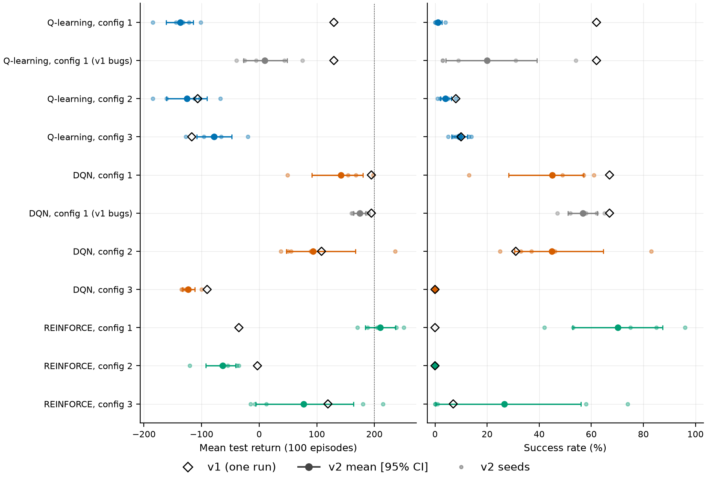
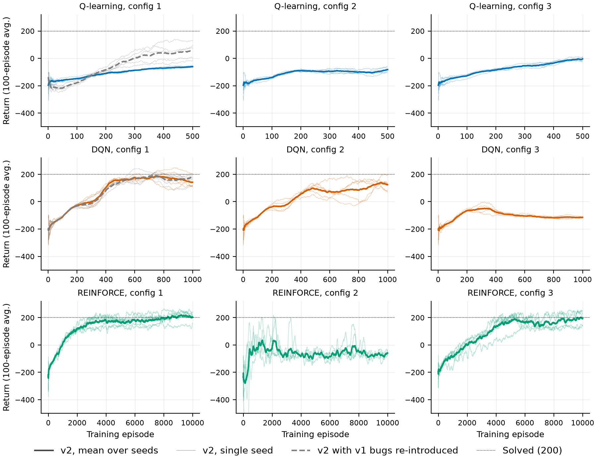

# Replication of the v1.0 results

The v1.0 version of this project (tag `v1.0-course-project`) reported one training run for each
of nine hyperparameter configurations: three each for Q-learning, DQN and REINFORCE. Those runs
were unseeded, the published code contained learning bugs, and that code could not have produced
the published figures. This study reruns all nine configurations on the corrected v2
implementation, with five seeds each, to find out which v1.0 conclusions survive.

## Summary

- **Five of the nine v1.0 results fall inside the range of five v2 seeds**: Q-learning configs 2
  and 3, DQN configs 1 and 2, and REINFORCE config 3. DQN config 3 fails in both versions
  (0% success) and lies just outside the v2 range.
- **Three are not reproduced**:
  - Q-learning config 1: v1 129.7, v2 −137.0.
  - REINFORCE config 1: v1 −35.2, v2 210.3.
  - REINFORCE config 2: v1 −3.0, v2 −63.1.
- **v1.0's ranking (DQN > Q-learning > REINFORCE) does not hold.** The best v2 configuration is
  REINFORCE config 1 (mean return 210.3, 70% success). REINFORCE was, however, given 10 to 20
  times more environment steps than the other two methods. A fair comparison needs equal budgets
  in steps, which is what the main benchmark does.
- **v1.0's best Q-learning result depended on one of its bugs.** v1.0 trained Q-learning
  greedily. Starting from a zero-initialised value function, in an environment whose per-step
  rewards are mostly negative, that made exploration systematic. Re-introducing the bug recovers
  v1.0's learning-curve shape and most of its gain. The corrected agent explores randomly and,
  with v1.0's slow ε decay, is still taking random actions 37% of the time when training ends.
- **The DQN truncation bug had no measurable effect.** Only 4–6% of late training episodes hit
  the time limit.
- **Single runs are not enough.** The spread across seeds of the same configuration reaches
  about 200 return points (DQN config 2, REINFORCE config 3). v1.0's numbers were one draw from
  such distributions.

## Method

**Configurations.** Hyperparameters were transcribed from the v1.0 tables
([docs/legacy/v1_results](legacy/v1_results)) into
[configs/experiments/replication_v1.yaml](../configs/experiments/replication_v1.yaml). Settings
that v1.0 fixed in code rather than in its tables are reproduced too:
- ε decays per episode, down to 0.01;
- Q-learning tile bounds come from the observation space;
- the DQN target network syncs every 10 episodes, learning starts at the first full batch, and gradients are not clipped;
- REINFORCE standardises returns within each episode.

**Budgets.** As in v1.0, training ran for a fixed number of episodes: 500 for Q-learning, 1,000
for DQN and 10,000 for REINFORCE. The resulting step counts are in the results table.

**Seeds and evaluation.** Each configuration ran with seeds 0–4. Every final policy was evaluated
greedily on the same 100 held-out episode seeds (10000–10099). As in v1.0, a success is an
episode that terminates with a return of at least 200. Intervals are 95% percentile-bootstrap
intervals over the five seeds. With five seeds they are a guide to seed-to-seed variation rather
than intervals with exact coverage.

**Bug-reproduction variants.** Two extra variants switch v1.0's learning bugs back on through
`reproduce_v1_bugs`:
- Q-learning config 1: greedy training with ties going to action 0, and TD targets that bootstrap past terminal states;
- DQN config 1: time-limit truncations stored as terminal transitions.

**What still differs from v1.0.**

| Difference | v1.0 | This study |
| :--- | :--- | :--- |
| Runs per configuration | 1, unseeded | 5, seeded |
| Test episodes | 100, unseeded | 100, fixed seeds shared by all runs |
| Tested policy | final in-memory policy, or a checkpoint if one existed when the script started | final policy |
| Tile offsets (Q-learning) | uniform | asymmetric (Sutton's `tiles3`) |
| Time limit (Q-learning) | ignored: episodes could exceed 1,000 steps | respected, also in the bug variant |
| DQN early stopping | stop once the 100-episode training average reaches 200 | none: full 1,000 episodes |
| Software versions | not recorded | recorded in each run's `meta.json` |

## Results

All numbers below are generated from the run directories. The figures and the table are
rebuilt by the commands in [Reproducing this study](#reproducing-this-study).



| Configuration | Budget | v1 return | v2 return [95% CI] | v2 seed range | v1 success | v2 success [95% CI] |
| :--- | ---: | ---: | ---: | ---: | ---: | ---: |
| Q-learning, config 1 | 500 ep / 58k steps | 129.7 | -137.0 [-161.6, -114.1] | -184.7 to -101.3 | 62% | 1% [0%, 3%] |
| Q-learning, config 1 (v1 bugs) | 500 ep / 188k steps | 129.7 | 9.7 [-27.1, 48.7] | -39.5 to 75.0 | 62% | 20% [4%, 39%] |
| Q-learning, config 2 | 500 ep / 102k steps | -106.7 | -125.7 [-160.5, -90.8] | -184.4 to -67.6 | 8% | 4% [2%, 6%] |
| Q-learning, config 3 | 500 ep / 124k steps | -117.0 | -78.0 [-108.5, -47.3] | -127.2 to -19.8 | 10% | 9% [6%, 12%] |
| DQN, config 1 | 1,000 ep / 424k steps | 194.7 | 142.2 [91.5, 180.2] | 49.1 to 197.6 | 67% | 45% [28%, 57%] |
| DQN, config 1 (v1 bugs) | 1,000 ep / 410k steps | 194.7 | 174.4 [163.7, 185.1] | 160.2 to 190.1 | 67% | 57% [51%, 62%] |
| DQN, config 2 | 1,000 ep / 325k steps | 108.2 | 93.6 [47.1, 167.0] | 37.5 to 236.0 | 31% | 45% [31%, 65%] |
| DQN, config 3 | 1,000 ep / 712k steps | -90.3 | -123.2 [-132.5, -111.4] | -135.0 to -100.3 | 0% | 0% [0%, 0%] |
| REINFORCE, config 1 | 10,000 ep / 4,809k steps | -35.2 | 210.3 [184.3, 236.4] | 170.2 to 251.0 | 0% | 70% [53%, 87%] |
| REINFORCE, config 2 | 10,000 ep / 8,787k steps | -3.0 | -63.1 [-92.6, -40.8] | -120.7 to -35.5 | 0% | 0% [0%, 0%] |
| REINFORCE, config 3 | 10,000 ep / 5,591k steps | 119.3 | 77.0 [-6.3, 163.5] | -14.7 to 214.9 | 7% | 27% [0%, 56%] |

The learning curves use the same quantity v1.0 plotted: the 100-episode moving average of
training returns.



## Findings

### Q-learning: v1.0's best configuration was tuned to a buggy agent

The corrected agent with v1.0 config 1 scores −137.0, far below v1.0's 129.7. Re-introducing the
bugs lifts it to 9.7, and its learning curve takes v1.0's distinctive shape: a dip to about −220
around episode 50, then a steady climb (compare
[v1.0's figure](legacy/v1_results/Q-learning_config1.JPG)). The training diagnostics in
`train_episodes.csv` explain why:

- **Greedy training on a zero-initialised value function explores systematically.** Most
  per-step rewards in LunarLander are negative, so untried actions keep a value of 0 and look
  better than tried ones: a form of optimism in the face of uncertainty. The corrected agent
  explores with ε-greedy instead.
- **v1.0's ε schedule only ever ran in the buggy agent, where ε had no effect.** A decay of
  0.998 per episode leaves ε at 0.37 after 500 episodes, so the corrected agent is still acting
  at random more than a third of the time when training ends. Configs 2 and 3, which decay at
  0.995 (ε = 0.08 at the end), do better.
- **v1.0's 4,096-entry table is too small.** It is completely full in every config 1 and 2 run,
  after which tiles share weights through hash collisions. Config 3's 8,192-entry table ends
  about 55% full, and config 3 is the best of the three corrected configurations.

v1.0's 129.7 is still above all five bug-reproducing seeds (best: 75.0). The remaining gap is
consistent with seed luck combined with the differences that could not be reproduced (uniform
tile offsets, ignored time limits), but this study cannot separate those causes.

### DQN: reproduced, and the bug did not matter

Configs 1 and 2 reproduce: v1.0's 194.7 and 108.2 lie inside the v2 seed ranges, and v1.0's
config 1 learning curve has the same shape as v2's. v1.0's 194.7 sits at the top of a range
that runs from 49.1 to 197.6, so a single run captures little of what the configuration
actually achieves.

Storing truncations as terminations made no detectable difference: 174.4 [163.7, 185.1] with the
bug against 142.2 [91.5, 180.2] without. The intervals overlap, and the fixed variant's lower
mean comes mainly from one seed (49.1). The bug can only matter on time-limit truncations, and
those made up just 4–6% of the last 100 training episodes.

Config 3 fails in both versions. Its discount factor γ = 0.9 gives an effective horizon of about
1/(1 − γ) = 10 steps, too short for the +100 landing bonus to influence decisions made while
descending. The agent instead learns to avoid the −100 crash by hovering: 67% of test episodes
time out and 31% drift out of bounds. This configuration also switched to MSE loss, so the
replication cannot attribute the failure to γ alone; ablation A2 tests the loss separately.

### REINFORCE: best of the three, at ten times the cost

Config 1 is the clearest contradiction of v1.0. All five v2 seeds land between 170.2 and 251.0
(70% success), against v1.0's −35.2 with 0% success. The algorithm, hyperparameters and budget
match, so something in v1.0's run differed in a way the published material does not record.
Two candidates are visible in the v1.0 code, though neither can be confirmed:
- the script silently skipped training and evaluated an existing checkpoint whenever one was present;
- all REINFORCE figures were titled "Configuration 1" whatever configuration produced them.

Config 2 (learning rate 0.01, γ = 0.95) collapses into hovering: 81% of test episodes time out.
It is the worst REINFORCE configuration in both versions, though v2 scores lower (−63.1 against
−3.0).

Config 3 reproduces (v1.0's 119.3 lies inside the v2 range) but varies widely between seeds.
Much of that variation comes from how the policy is evaluated rather than how well it was
learned. REINFORCE trains a stochastic policy, and v1.0, like this study, tested it by always
taking the most probable action. Sampling actions from the same final policies instead gives:

| Configuration | Most probable action (reported) | Sampled actions |
| :--- | ---: | ---: |
| REINFORCE, config 1 | 210.3 (70% success) | 204.6 (72%) |
| REINFORCE, config 2 | -63.1 (0%) | -63.8 (0%) |
| REINFORCE, config 3 | 77.0 (27%) | 196.7 (50%) |

With γ = 0.999 (config 3), the argmax policy often hovers until the time limit, while the
sampled policy lands. Ablation A6 studies this properly.

REINFORCE's strong showing comes at a cost the episode budget hides. Its 10,000 episodes took
4.8 to 8.8 million environment steps, against 0.3 to 0.7 million for DQN's 1,000 episodes. v1.0's
comparison gave each method a different number of episodes, so it never measured which method
learns more from the same experience.

## Implications for v2

1. **Compare at equal environment steps, with many seeds.** Per-method episode budgets confound
   sample efficiency with final performance, and single runs are within-distribution noise. The
   main benchmark uses 1M steps per run and 10 seeds.
2. **Do not reuse v1.0's Q-learning hyperparameters.** They were chosen for an agent with
   different exploration. Phase 2 found tighter tile bounds, 4 tiles per dimension and a much
   larger table to work better; these settings will be tuned for the benchmark.
3. **Report how stochastic policies are evaluated.** Argmax evaluation can understate
   REINFORCE by more than 100 return points (ablation A6).
4. **Watch for the hovering local optimum.** Short horizons (γ ≤ 0.95) or unstable updates lead
   policies to avoid the crash penalty by hovering until the time limit. The outcome breakdown in
   every evaluation (landed / crashed / out of bounds / timeout) exposes this.

## Reproducing this study

```bash
python scripts/sweep.py configs/experiments/replication_v1.yaml   # 55 runs, completed runs are skipped
python scripts/aggregate.py runs/replication_v1                    # results/summary/replication_v1_*.csv
python scripts/make_tables.py replication                          # results/tables/replication_v1.md
python scripts/make_figures.py replication                         # results/figures/replication_v1/

# sampled-action evaluation of one REINFORCE run (repeat for each config and seed)
python scripts/evaluate.py runs/replication_v1/reinforce_cfg3/seed_0 --stochastic
```

Runs are deterministic given the seed on the same platform and package versions. On a 12-core
desktop CPU, each Q-learning run takes under a minute, each DQN run 8–18 minutes and each
REINFORCE run 18–30 minutes. Per-configuration training times are in
`results/summary/replication_v1_summary.csv`.
